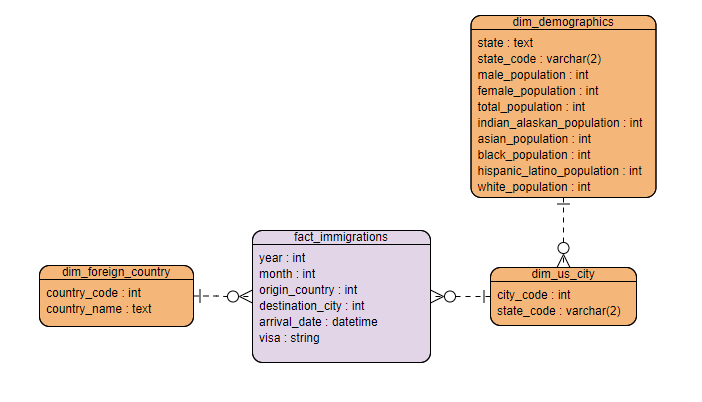

# DEND Capstone Project : Immigrations_Analysis
> This readme explains background and context of the project. Refer to immigrations_pipeline.ipynb for detailed pipeline and data dictionary. 
## Background
- This is a capstone project of Udacity's Data Engineering Nanodegree (DEND). 
- Taking DEND, I've learned the following topics 
    1. Relational Data Modeling (Postgres)
    2. NoSQL Data Modeling (Apache Cassandra)
    3. Data warehouses (AWS S3, Redshift)
    4. Data lakes (Apache Spark)
    5. Data Pipelines (Apache Airflow)
- There were projects for each topic. You can see topic related projects in my repository. (DEND_P1 ~ P5)
- Capstone project is designed to practice data engineering using topics learned throughout the program. 
    - Data set is provided by Udacity, but very little guidelines
    - Guideline was given as a form of project rubric (Abstracted)
    - Choosing analysis topic, implenting and debugging pipeline were done by myself

## Provided Data Set
- **I94 Immigration Data**: This data comes from the US National Tourism and Trade Office. A data dictionary is included in the workspace. [This](https://travel.trade.gov/research/reports/i94/historical/2016.html) is where the data comes from. There's a sample file so you can take a look at the data in csv format before reading it all in. You do not have to use the entire dataset, just use what you need to accomplish the goal you set at the beginning of the project.
- **World Temperature Data**: This dataset came from Kaggle. You can read more about it [here](https://www.kaggle.com/berkeleyearth/climate-change-earth-surface-temperature-data).
- **U.S. City Demographic Data**: This data comes from OpenSoft. You can read more about it [here](https://public.opendatasoft.com/explore/dataset/us-cities-demographics/export/).
- **Airport Code Table**: This is a simple table of airport codes and corresponding cities. It comes from [here](https://datahub.io/core/airport-codes#data).

## Scope of the Analysis (Requirement of Data Pipeline)
- Analysing correlation between number of immigrants and US state demographics
- Among given data set, I used I94 Immigration Data and U.S. City Demographic Data 

## Data Model

## Tools Used
- I used Spark and Pandas to make data pipeline
- I found ELT approach interesting, so I decided to use Spark to utilize its schema on read feature.
- Also, size of the I94 Immigration Data set is huge. Distributed processing tools were needed. 

## Limitations
- I've used Spark local mode on a single node. The pipeline was built and tested with subset of the given data. 
- During the project, I concentrated on making the pipeline. There are no real analysis done in the Jupyter notebook. 
- Codes are only written in the jupyter notebook (No spark scripts. although anyone can transfrom jupyter notebook codes into a spark script in no time.)

